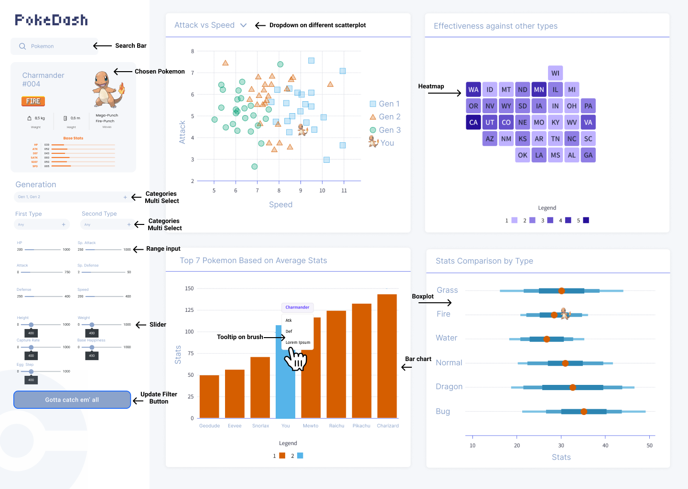

# Pokémon Dashboard: Proposal

## Section 1: Motivation and Purpose

> In a few sentences, provide motivation for why you are creating a dashboard:
>
> - Who is your target audience, and what role are you embodying?
> - What is the problem the target audience is facing and why is it important to solve?
> - How can your dashboard assist in solving this problem for the intended target audience?

Our role: Data Analyst in Nintendo

Target audience: New Pokémon Player

With the growing popularity of the Pokémon TCG and mobile games, more players are entering the Pokémon world. However, newcomers often feel overwhelmed by the vast number of Pokémon and struggle to find ones that match their interests. Understanding key attributes such as stats, types, abilities, and battle effectiveness is essential for competitive players, while casual fans may enjoy exploring details like height, weight, and generation. To make this easier, we propose an interactive Pokémon Dashboard that simplifies Pokémon exploration. This tool will visualize key attributes, enable direct comparisons, and provide filtering and sorting options to help users analyze Pokémon in a way that suits their needs. By allowing users to filter by generation, they can better understand how a Pokémon stacks up against others from the same era, making team-building and discovery more intuitive.

## Section 2: Description of the Data

We will be visualizing a dataset with 801 rows and 41 columns. Each of the 801 rows represents a single Pokémon, and each Pokémon has 41 variables that describe its characteristics. This comprehensive set of characteristics will make it easy for our target audience (new Pokémon player) to fully understand the Pokémon that are of interest to them. The primary attributes we will focus on visualizing for each Pokémon include:

- `name`: The English name of the Pokémon
- `type1`, `type2`: The primary and secondary type (eg. Fire, Water, Grass, etc.)
- `height_m`, `weight_kg`: The height and weight
- `against_?`: Eighteen features that denote the damage taken against an attack of a particular type
- `hp`, `attack`, `defense`, `sp_attack`, `sp_defense`, `speed`: Base stats of the Pokémon
- `generation`: The video game generation that the Pokémon was introduced
- `is_legendary`: Whether the Pokémon is legendary or not

The dataset also includes several attributes that could be of interested during our visualization, such as `percentage_male`, `capture_rate`, `base_egg_steps`, `abilities`, `experience_growth`, and `base_happiness`. More information about the dataset can be found from the [Kaggle source](https://www.kaggle.com/datasets/rounakbanik/pokemon/data).

Using this data we will also derive new variables, such as the sum of the Pokémon's base stats (`base_stat_total`) as a method of ranking Pokémon overall. It would also be useful to track which Pokémon evolve into other Pokémon (`evolves_to`, `evolves_from`), but this is a complex feature to engineer. It would be interesting to see how these new features could help new Pokémon players better understand the Pokémon.

## Section 3: Research Questions and Usage Scenarios

> The purpose of this section is to get you to think in more detail about how your target audience will use the app you're designing and to account for these detailed needs in the proposal. For this it can be helpful to create a brief persona description of a member in your intended target audience. Then, think about what they might want to do with your app and write small user story. User stories are typically written in a narrative style and include:
>
> - The specific context/background of the user
> - The overall goal of the user
> - Tasks needed to reach that goal
> - A hypothetical walkthrough of how the user would accomplish those tasks with your app
> - The outcome/action that the user would take based on the information they find in the app

John loved Pokémon as a child in the 90’s, but after growing up he’s forgotten about most of the Pokémon he once had and hasn’t kept track of the new Pokémon that have been added in more recent generations. He wants an easy, accessible method to explore the stats of different Pokémon, and see any key differences across different generations.

Once John visits our Pokémon dashboard he’ll see a spot to select the Pokémon he's interested in exploring. Different filters to compare this selected Pokémon to other generations, types of Pokémon, or based on specific characteristics like attack, defense, height, weight, etc. He decides to select Charmander as the main Pokémon to explore as it was his favourite as a kid. Now he can see how effective Charmander (and fire types generally) are against other Pokémon types. He also views Charmander on the overall scatter plot of attack vs. defense to see where he falls. He also chooses to see weight plotted on the boxplot to compare all the types against one another and see how Charmander fairs. After exploring he then decides to check out a different fire type, Vulpix.

Based on his time spent exploring different Pokémon in our app, John has a clearer understanding of various Pokémon stats such as height, weight, attack, defense, abilities, and more. Armed with this new knowledge, he feels confident in continuing to build his Pokémon team and battle others. He’s also excited to put this new knowledge to practice and see how his Pokémon perform. Time to catch 'em all!

## Section 4: App Sketch & Brief Description

The Pokémon Dashboard is an interactive tool designed for exploring and comparing Pokémon stats with ease. Users can search for a specific Pokémon, such as "Charmander," and view its detailed attributes. The dashboard includes multi-select filters for refining results by generation and primary/secondary types, as well as range sliders to adjust filters for HP, Attack, Defense, Sp. Attack, Sp. Defense, and Speed. A heatmap visualizes type effectiveness, while scatter plots allow users to compare different stat pairings, such as Attack vs. Speed, with the selected Pokémon highlighted. A bar chart showcases the top 7 Pokémon based on average stats, and a box plot enables comparisons of stats grouped by type that was selected before, such as Grass, Fire, or Water. Users can interact with the charts by brushing over data points to reveal tooltips. Additionally, the “Gotta Catch 'Em All” button refreshes the visualizations with updated selections, ensuring a dynamic and engaging experience for analyzing Pokémon stats.
